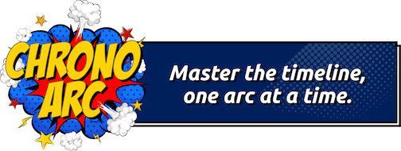

# 🦸 Marvel PHP SDK

Welcome to the **Marvel PHP SDK**, a lightweight and easy-to-use SDK designed to interact with
the [Marvel API](https://developer.marvel.com/), built on top of the robust [Saloon](https://docs.saloon.dev)
library.

> [!WARNING]
> This project is a work in progress. Currently, it supports only the endpoints I need for another app I'm building.
> However, the SDK is designed to be extensible, making it easy to add support for additional endpoints.

## 🚧 Progress

- [ ] Use enums for query parameters:
    - [ ] CharacterOrderBy
    - [x] ComicOrderBy
    - [ ] CreatorOrderBy
    - [ ] EventOrderBy
    - [ ] SeriesOrderBy
    - [ ] StoryOrderBy
    - [ ] DateDescriptor
    - [x] ComicFormat
    - [x] ComicFormatType
- Url types to be also enums (where can I see all types?)
- [ ] Tests
- [ ] Submit to Packagist

| **Endpoint**                      | **Status** |
|-----------------------------------|:----------:|
| /characters                       |     ✅      |
| /characters/{characterId}         |     ✅      |
| /characters/{characterId}/comics  |     ✅      |
| /characters/{characterId}/events  |     ✅      |
| /characters/{characterId}/series  |     ✅      |
| /characters/{characterId}/stories |     ✅      |
| /comics                           |     ✅      |
| /comics/{comicId}                 |     ✅      |
| /comics/{comicId}/characters      |     ✅      |
| /comics/{comicId}/creators        |     ✅      |
| /comics/{comicId}/events          |     ✅      |
| /comics/{comicId}/stories         |     ✅      |
| /creators                         |     ✅      |
| /creators/{creatorId}             |     ✅      |
| /creators/{creatorId}/comics      |     ✅      |
| /creators/{creatorId}/events      |     ✅      |
| /creators/{creatorId}/series      |     ✅      |
| /creators/{creatorId}/stories     |     ✅      |
| /events                           |     ✅      |
| /events/{eventId}                 |     ✅      |
| /events/{eventId}/characters      |     ✅      |
| /events/{eventId}/comics          |     ✅      |
| /events/{eventId}/creators        |     ✅      |
| /events/{eventId}/series          |     ✅      |
| /events/{eventId}/stories         |     ✅      |
| /series                           |     ✅      |
| /series/{seriesId}                |     ✅      |
| /series/{seriesId}/characters     |     ✅      |
| /series/{seriesId}/comics         |     ✅      |
| /series/{seriesId}/creators       |     ✅      |
| /series/{seriesId}/events         |     ✅      |
| /series/{seriesId}/stories        |     ✅      |
| /stories                          |     ✅      |
| /stories/{storyId}                |     ✅      |
| /stories/{storyId}/characters     |     ✅      |
| /stories/{storyId}/comics         |     ✅      |
| /stories/{storyId}/creators       |     ✅      |
| /stories/{storyId}/events         |     ✅      |
| /stories/{storyId}/series         |     ✅      |

## 🚀 Getting Started

### Installation

You can install the SDK via Composer:

```bash
composer require chronoarc/marvel-sdk
```

### Usage

```php
require 'vendor/autoload.php';

$publicKey = 'your-public-key-here';
$privateKey = 'your-private-key-here';

$marvel = new  Chronoarc\Marvel\Marvel($publicKey, $privateKey);

$superhero = ['name' => 'Spider-Man (Peter Parker)', 'id' => 1009610];

$characters = $marvel->characters()->search(name: $superhero['name']);
$characters->dto(); // Chronoarc\Marvel\Dto\CharacterDataWrapper

$character = $marvel->characters()->getCharacter($superhero['id']);
$character->dto(); // Chronoarc\Marvel\Dto\CharacterDataWrapper

$characterSeries = $marvel->characters()->getCharacterSeries($superhero['id']);
$characterSeries->dto(); // Chronoarc\Marvel\Dto\SeriesDataWrapper

$characterComics = $marvel->characters()->getCharacterComics($superhero['id']);
$characterComics->dto(); // Chronoarc\Marvel\Dto\ComicDataWrapper

$characterEvents = $marvel->characters()->getCharacterEvents($superhero['id']);
$characterEvents->dto(); // Chronoarc\Marvel\Dto\EventDataWrapper

$characterStories = $marvel->characters()->getCharacterStories($superhero['id']);
$characterStories->dto(); // Chronoarc\Marvel\Dto\StoryDataWrapper
```

## 🤝 Contributions Welcome

Your feedback and contributions are highly appreciated! Whether it’s submitting an issue, suggesting improvements, or
adding new features, every bit helps make this SDK better for everyone.

---

Feel free to fork the repository, make pull requests, or just share ideas! Let's make this SDK awesome together.

## 📝 License

MIT

## ChronoArc

<p align="center">

</p>

This SDK is made for ChronoArc, an app I am trying to build an app that lets you create reading guides, subscribe to
already created guides, and track your
progress towards reading a specific guide.

There's another SDK that uses Comicvine API, which is also part of the ChronoArc project. You can check it
out at [chronoarc/comicvine-sdk](https://github.com/fakeheal/comicvine-sdk).